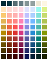

# Solarized Expanded

**Solarized Expanded** is an 80 color palette (eight monotones, 72 colors) based on [Ethan Schoonover's](https://ethanschoonover.com/) original [Solarized palette](https://ethanschoonover.com/solarized/). Besides the sixteen colors of the original palette, Solarized Expanded provides 32 tints and 32 shades of the original's accent colors.

# Installation

Varies by software. Use Google to find instructions for installing or managing user color palettes in your software of choice.

The Adobe Swatch Exchange (`.ase`) file was exported from [Gpick](http://www.gpick.org/). I don't use Adobe products, so I don't know if it works. Open an issue at https://github.com/DanielFlaum/solarized-expanded/issues if you experience problems.

# Method

This is a bit embarrassing, but I *forget*. I made this palette years ago for some side project or other, and I didn't keep notes of what I did. I'm also not a design person with any color expertise. I remember that I cared that the shades and tints of each color look equally bright or dark across the different colors, and that this was not so simple as just multiplying the RGB values by some constant.

I'm *pretty sure* I used the R language and the excellent [`colorspace`](https://colorspace.r-forge.r-project.org/index.html) package's [`lighten()` and `darken()` functions](https://colorspace.r-forge.r-project.org/reference/lighten.html). I cannot remember what specific parameter values I used.
